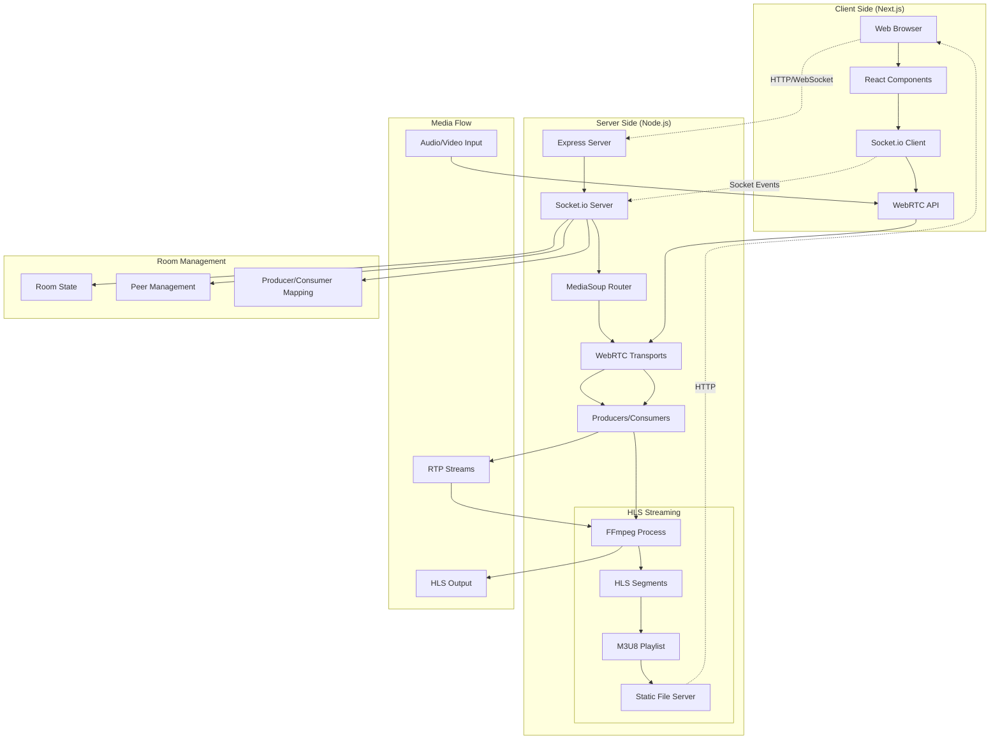

# WebRTC Demo with MediaSoup and HLS Streaming

A real-time communication application built with WebRTC, MediaSoup, and HLS streaming capabilities using Next.js and Node.js.

## 🎥 Demo Video

https://github.com/user-attachments/assets/c2977733-31a7-4e85-a012-bcb101984cd1

## 🏗️ System Architecture



## 🚀 Features

- **Real-time Communication**: WebRTC-based audio/video streaming
- **Scalable Media Server**: MediaSoup SFU (Selective Forwarding Unit)
- **HLS Streaming**: Live HTTP streaming with FFmpeg integration
- **Room-based Sessions**: Multi-user room management
- **Optimized Performance**: Set-based data structures and async/await patterns
- **Comprehensive Logging**: Structured logging system
- **Error Handling**: Robust error boundaries and resource cleanup

## 📁 Project Structure

```
wec-demo/
├── my-app/
│   ├── src/app/              # Next.js application
│   ├── public/               # Static assets
│   ├── hls/                  # HLS output directory
│   ├── server.js             # MediaSoup + Socket.io server
│   ├── package.json          # Dependencies
│   └── next.config.ts        # Next.js configuration
└── README.md                 # This file
```

## 🔧 Technology Stack

### Frontend
- **Next.js 15**: React framework with App Router
- **TypeScript**: Type-safe development
- **Socket.io Client**: Real-time communication
- **WebRTC API**: Browser media capabilities

### Backend
- **Node.js**: JavaScript runtime
- **Express**: Web server framework
- **Socket.io**: WebSocket communication
- **MediaSoup**: WebRTC SFU media server
- **FFmpeg**: Media processing and HLS generation

## 🏃‍♂️ Getting Started

### Prerequisites
- Node.js 18+
- FFmpeg installed on system
- Modern web browser with WebRTC support

### Installation

1. **Clone the repository**
   ```bash
   git clone <repository-url>
   cd wec-demo/my-app
   ```

2. **Install dependencies**
   ```bash
   npm install
   ```

3. **Start the MediaSoup server**
   ```bash
   node server.js
   ```

4. **Start the Next.js development server**
   ```bash
   npm run dev
   ```

5. **Access the application**
   - Frontend: `http://localhost:3000`
   - MediaSoup Server: `http://localhost:3001`
   - HLS Streams: `http://localhost:3001/hls/{roomId}/index.m3u8`

## 🔄 Data Flow

### 1. Client Connection
```
Browser → Socket.io → Server → MediaSoup Router
```

### 2. Media Production
```
User Media → WebRTC → Transport → Producer → Room State
```

### 3. Media Consumption
```
Producer → Consumer → Transport → WebRTC → Remote Client
```

### 4. HLS Streaming
```
Producers → Plain Transport → FFmpeg → HLS Segments → HTTP Server
```

## 🎛️ API Events

### Socket.io Events

| Event | Direction | Description |
|-------|-----------|-------------|
| `joinRoom` | Client → Server | Join a specific room |
| `getRtpCapabilities` | Client → Server | Get MediaSoup capabilities |
| `createTransport` | Client → Server | Create WebRTC transport |
| `connectTransport` | Client → Server | Connect transport with DTLS |
| `produce` | Client → Server | Start media production |
| `consume` | Client → Server | Start media consumption |
| `getProducers` | Client → Server | Get available producers |
| `startHLS` | Client → Server | Start HLS streaming |
| `stopHLS` | Client → Server | Stop HLS streaming |
| `newProducer` | Server → Client | Notify new producer available |

## 🏗️ Architecture Components

### MediaSoup Server (`server.js`)
- **Worker Management**: CPU-optimized media processing
- **Router**: RTP capabilities and codec management
- **Transport**: WebRTC and Plain RTP transport handling
- **Producer/Consumer**: Media stream management
- **Room Management**: Multi-user session handling

### HLS Streaming Pipeline
1. **Media Collection**: Gather audio/video producers from room
2. **Transport Creation**: Setup plain RTP transports
3. **Consumer Setup**: Create consumers for each media stream
4. **SDP Generation**: Create audio/video SDP files
5. **FFmpeg Processing**: Convert RTP to HLS segments
6. **File Serving**: Serve HLS playlist and segments

### Configuration Management
```javascript
CONFIG = {
  MEDIASOUP: {
    worker: { logLevel: 'warn', rtcMinPort: 10000, rtcMaxPort: 10100 },
    router: { mediaCodecs: [...] }
  },
  TRANSPORT: {
    listenIps: [{ ip: '127.0.0.1', announcedIp: null }],
    enableUdp: true, enableTcp: true, preferUdp: true
  },
  HLS: {
    segmentDuration: 4, playlistLength: 6,
    keyframeInterval: 5000
  }
}
```

## 🔍 Monitoring & Debugging

### Logging Levels
- **DEBUG**: Detailed operation logs
- **INFO**: General information and state changes
- **WARN**: Warning conditions
- **ERROR**: Error conditions and exceptions

### Health Checks
- MediaSoup worker status
- Active room monitoring
- HLS process management
- Resource cleanup verification

## 🚀 Performance Optimizations

- **Set-based Collections**: O(1) operations for transports, producers, consumers
- **Async/Await Patterns**: Non-blocking operations
- **Resource Pooling**: Efficient MediaSoup worker management
- **Error Boundaries**: Graceful failure handling
- **Memory Management**: Automatic cleanup on disconnect

## 🔒 Security Considerations

- DTLS encryption for WebRTC transports
- Room-based isolation
- Resource cleanup on disconnect
- Input validation for all socket events

## 📈 Scalability

- **Horizontal Scaling**: Multiple MediaSoup workers
- **Load Balancing**: Worker distribution
- **Resource Limits**: Configurable stream limits
- **Cleanup Automation**: Automatic resource management

## 🤝 Contributing

1. Fork the repository
2. Create a feature branch
3. Make your changes
4. Add tests if applicable
5. Submit a pull request

## 📄 License

This project is licensed under the MIT License.

## 🆘 Troubleshooting

### Common Issues

1. **FFmpeg not found**
   - Install FFmpeg: `brew install ffmpeg` (macOS) or `apt install ffmpeg` (Ubuntu)

2. **Port conflicts**
   - Check if ports 3000, 3001, or 10000-10100 are in use
   - Modify configuration in `server.js`

3. **WebRTC connection issues**
   - Ensure HTTPS for production
   - Check firewall settings for UDP ports

4. **HLS streaming problems**
   - Verify FFmpeg installation
   - Check HLS directory permissions
   - Monitor server logs for FFmpeg errors

---

**Built with ❤️ using MediaSoup, WebRTC, and modern web technologies**