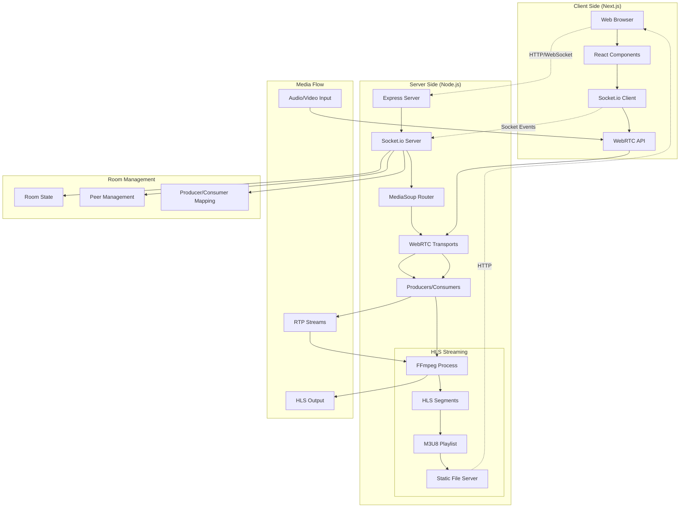

# WebRTC Demo with MediaSoup and HLS Streaming

A real-time communication application built with WebRTC, MediaSoup, and HLS streaming capabilities using Next.js and Node.js.

## 🎥 Demo Video

https://github.com/user-attachments/assets/c2977733-31a7-4e85-a012-bcb101984cd1

## 🏗️ System Architecture

